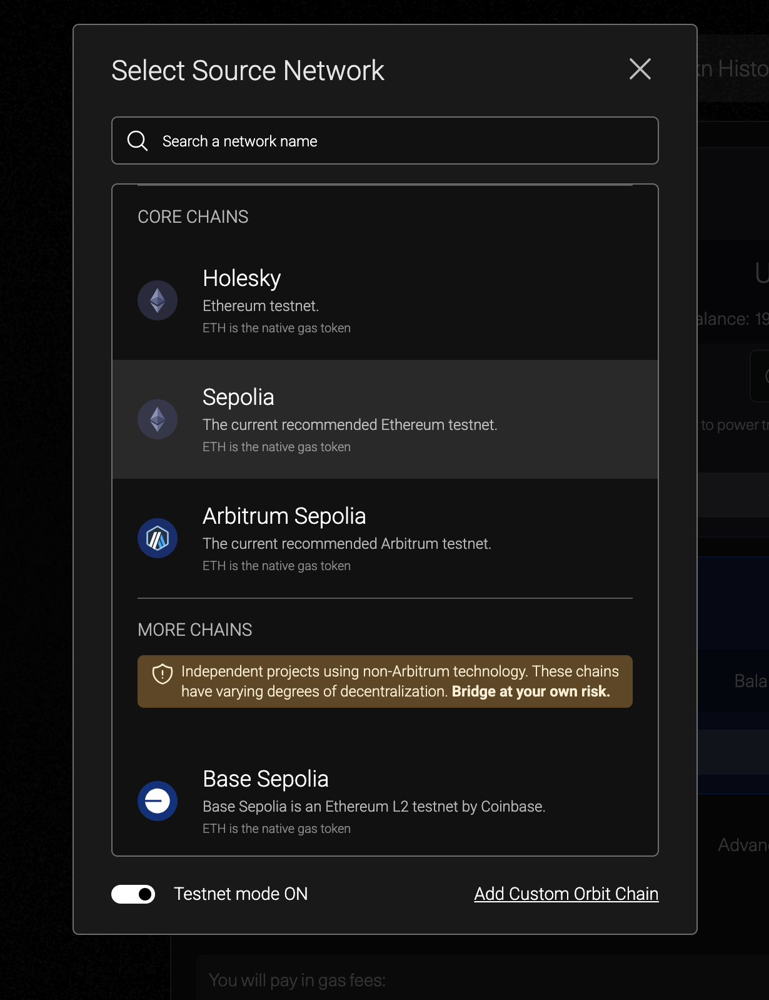
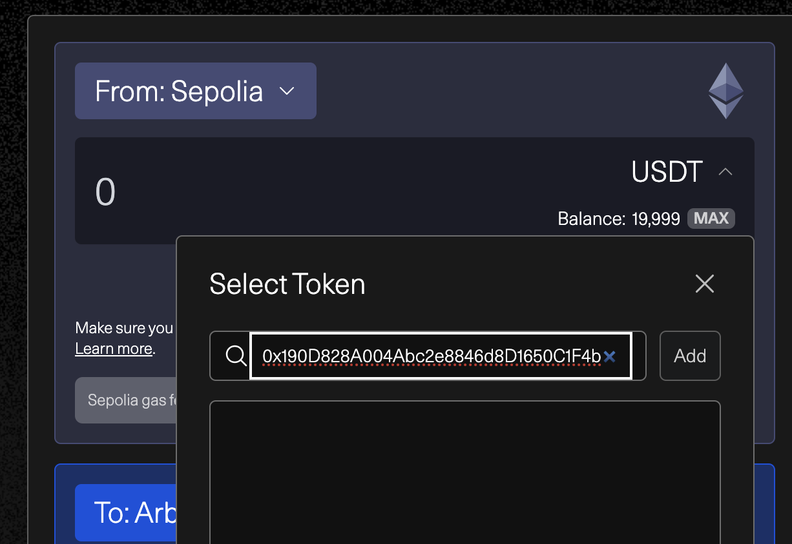
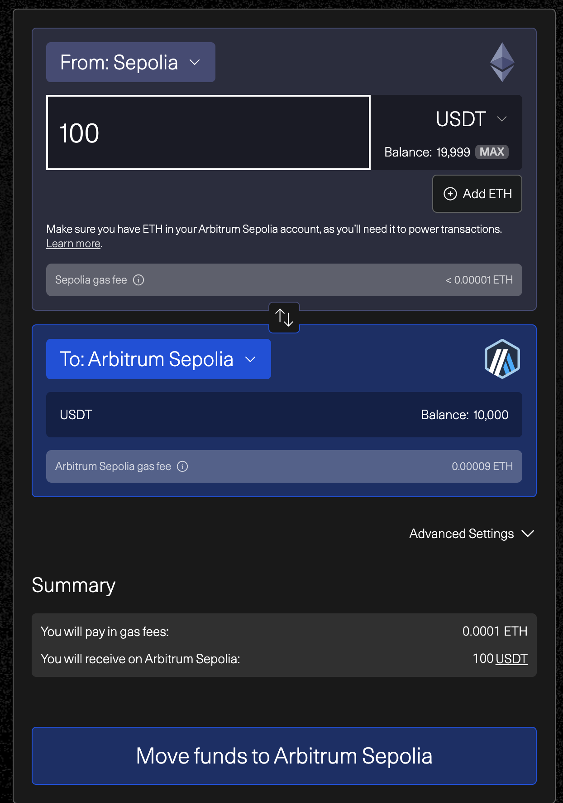

### 🔹 Ethereum Sepolia

- **Sepolia ETH**  
  👉 [https://www.alchemy.com/faucets/ethereum-sepolia](https://www.alchemy.com/faucets/ethereum-sepolia)

- **USDC**  
  👉 [https://faucet.circle.com/](https://faucet.circle.com/)

- **USDT**  
  👉 [https://app.aave.com/faucet/?marketName=proto_sepolia_v3](https://app.aave.com/faucet/?marketName=proto_sepolia_v3)

---

### 🔹 Arbitrum Sepolia

- **Arbitrum Sepolia ETH**  
  👉 [https://www.alchemy.com/faucets/arbitrum-sepolia](https://www.alchemy.com/faucets/arbitrum-sepolia)

- **USDC**  
  👉 [https://faucet.circle.com/](https://faucet.circle.com/)

- **USDT (브릿지를 통해 얻기)**  
  👉 [https://bridge.arbitrum.io/?destinationChain=arbitrum-sepolia&sourceChain=sepolia&token=0xaa8e23fb1079ea71e0a56f48a2aa51851d8433d0](https://bridge.arbitrum.io/?destinationChain=arbitrum-sepolia&sourceChain=sepolia&token=0xaa8e23fb1079ea71e0a56f48a2aa51851d8433d0)

> 📌 **설명:** Arbitrum Sepolia의 USDT는 **Ethereum Sepolia** 네트워크에서 발행된 USDT를 **Arbitrum 공식 브릿지**를 통해 이동시켜야 합니다.

**브릿지 사용 방법**
1. 페이지 좌측 상단의 `<From: Sepolia ∨>` 클릭 → `Testnet mode`를 **활성화**  
   

2. 우측 입력창에서 토큰 선택 영역 클릭 → **컨트랙트 주소 입력 후 Add**  
   - `0xaA8E23Fb1079EA71e0a56F48a2aA51851D8433D0`  
   

3. 원하는 수량 입력 후 `Move fund to Arbitrum Sepolia` 클릭  
   

---

### 🔹 Base Sepolia

- **Base Sepolia ETH**  
  👉 [https://www.alchemy.com/faucets/base-sepolia](https://www.alchemy.com/faucets/base-sepolia)

- **USDC**  
  👉 [https://faucet.circle.com/](https://faucet.circle.com/)

- **USDT**  
  👉 *크로믹스 담당 매니저에게 요청해 주세요*

---

### 🔹 Polygon Amoy

- **Amoy POL**  
  👉 [https://www.alchemy.com/faucets/polygon-amoy](https://www.alchemy.com/faucets/polygon-amoy)

- **USDC**  
  👉 [https://faucet.circle.com/](https://faucet.circle.com/)

- **USDT**  
  👉 *크로믹스 담당 매니저에게 요청해 주세요*

---

<CardGroup cols={2}>
  <Card
    title="Sepolia ETH 받기"
    icon="coins"
    href="https://www.alchemy.com/faucets/ethereum-sepolia"
  >
    가장 많이 사용되는 Ethereum 테스트넷용 ETH
  </Card>
  <Card
    title="Circle 테스트 토큰 받기"
    icon="coins"
    href="https://faucet.circle.com/"
  >
    USDC를 포함한 Circle 테스트 토큰 수령
  </Card>
</CardGroup>

> ℹ️ **테스트 토큰은 실제 자산 가치가 없으며**, 오직 개발/테스트 용도로만 사용됩니다.
